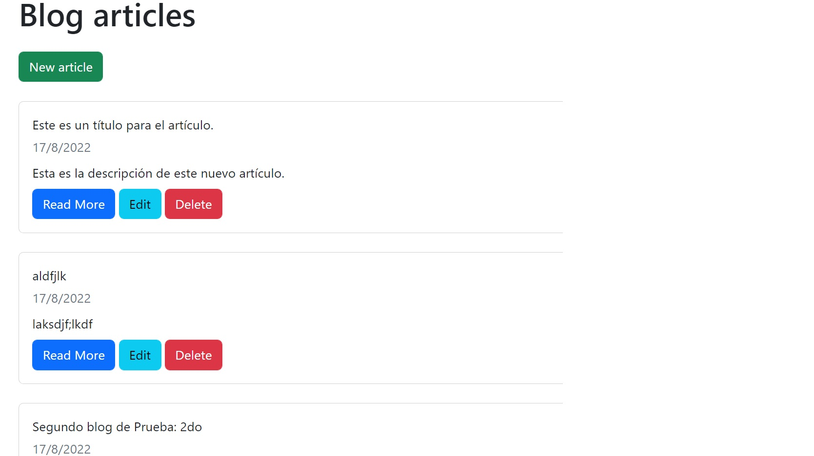
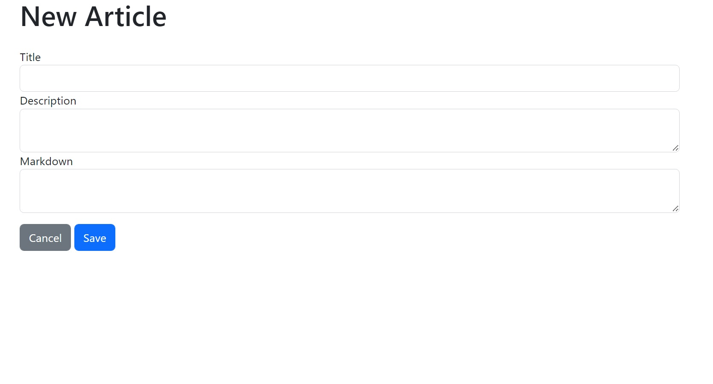
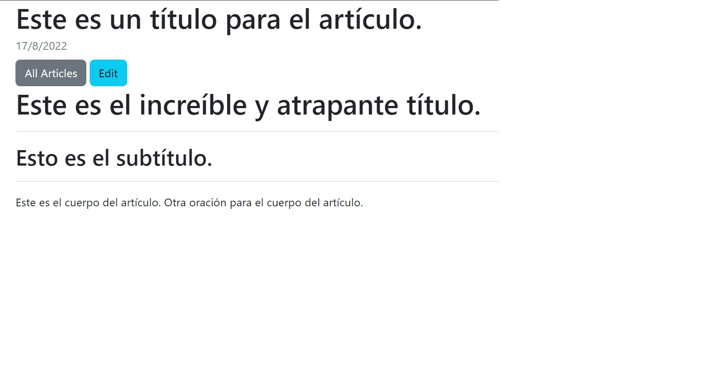
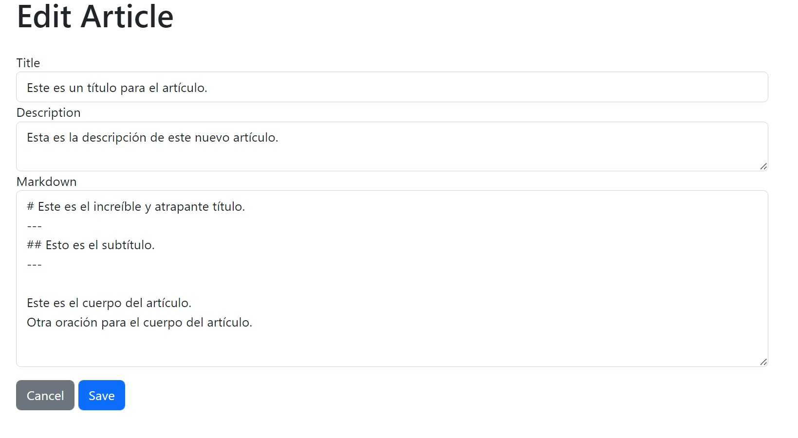

# my-markdown-blog
## Franco-Ibanez-Dev     August 2022

This is a little project to practice technologies like express and mongoDB.

It allows the user to view, create, edit and delete articles. this articles have a title, description and body. The last one can be write in markdown language.

## Stack of technologies

- dompurify ^2.3.10
- ejs ^3.1.8
- express ^4.18.1
- jsdom ^20.0.0
- marked ^4.0.18
- method-override ^3.0.0
- slugify ^1.6.5
 
### DataBase
- mongoose ^6.5.2 

In order to have the project runnig locally you must have installed MongoDB on your machine.
<a href="https://youtu.be/wcx3f0eUiAw">MongoDB Install Tutorial</a>

---

<h2>Some Screenshots:</h2>

<h5>Main route</h5>

<h5>New article route</h5>

<h5>Show article route</h5>

<h5>Edit article route</h5>

---

### Credits:
For this project I took inspiration from this <a href="https://www.youtube.com/c/WebDevSimplified">youtube channel</a>.
